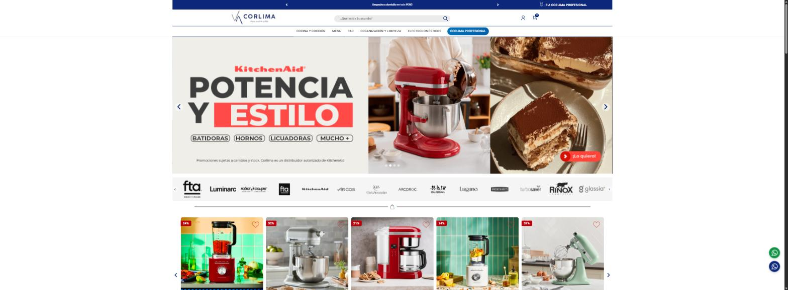
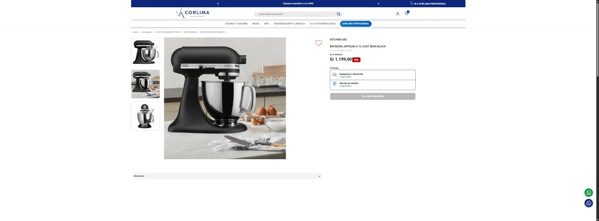
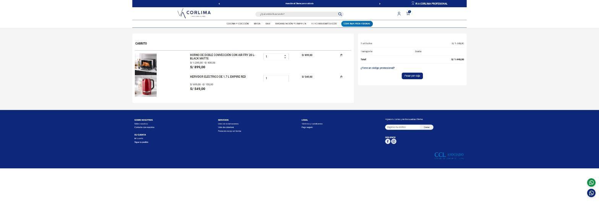
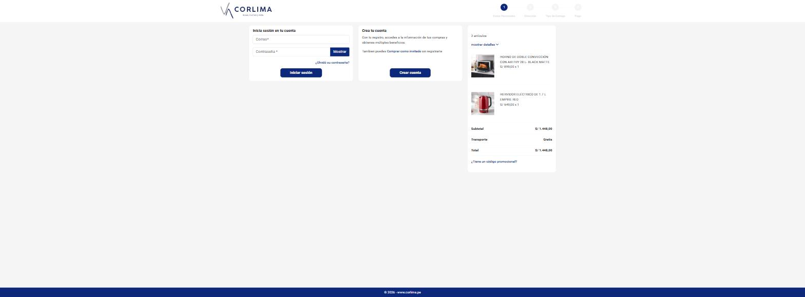
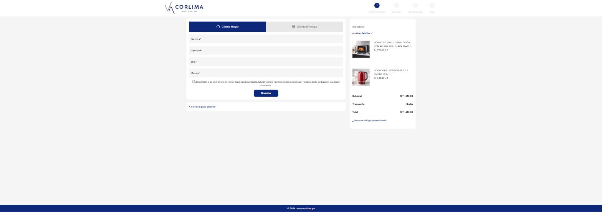

# Flujo del comprador — de la portada al pedido

Recorrido real capturado el 2026-08-04. Cada paso enlaza a la captura de código
(`capturas/`) y a la imagen (`docs/img/`).

## 1. Portada — `/`

Punto de entrada. Banners (KitchenAid, Luminarc), carrusel de marcas y productos
destacados con descuento. Menú por categorías: Cocina y Cocción, Mesa, Bar,
Organización y Limpieza, Electrodomésticos, más "Corlima Profesional".

## 2. Categoría — `/categoria/{id}/{slug}`
Listado de productos con filtros. Ej.: `/categoria/1000/bar`.
Cada tarjeta usa el markup `digi-product-*` (módulo de categoría de digitag).

## 3. Ficha de producto — `/{categoria}/{slug}-{id}.html`

Galería, precio con descuento, y bloque de **Entrega** con dos modalidades del
módulo click&collect: "Despacho a domicilio" y "Recojo en tienda". Botón de
añadir al carrito (en el ejemplo capturado el producto estaba sin stock).

## 4. Carrito — `/carrito`

Lista de artículos con cantidades editables, precio tachado + precio con
descuento, subtotal, transporte y total. Botón **"Pasar por caja"** que lleva a
`/pedido`. También aparece "¿Tiene un código promocional?".

## 5. Checkout — `/pedido` (one-page, 4 pasos)
Pasos: **1 Datos Personales · 2 Direcciones · 3 Método de envío · 4 Pago**.
El paso 1 está personalizado por los módulos `digitag_registerhook` y
`prestaclhook`.

### 5a. Paso 1 tal como lo ve el usuario — la puerta de cuenta

Tres bloques compiten por la atención:

1. **Inicia sesión en tu cuenta** (correo + contraseña) — izquierda, destacado.
2. **Crea tu cuenta** con botón grande "Crear cuenta" — centro.
3. **"También puedes Comprar como invitado sin registrarte"** — enlace pequeño,
   en texto, dentro del bloque de crear cuenta.

Esta es la pantalla donde se pierde al comprador: visualmente **parece
obligatorio registrarse o iniciar sesión**, y la salida (invitado) es lo menos
llamativo de la vista.

### 5b. Formulario de invitado (al pulsar "Comprar como invitado")

Se despliega un formulario corto — **Nombre, Apellidos, DNI, Correo** — con un
toggle "Cliente Hogar / Cliente Empresa" y una casilla opcional de suscripción.
Es un formulario simple; el problema es solo que hay que **descubrirlo**.

### Pasos 2-4
Direcciones, método de envío y pago se desbloquean tras completar el paso 1. No
se capturaron porque exigen enviar datos personales reales (no se hizo por
privacidad y para no generar un pedido).

## Resumen del punto de fricción

El abandono no viene de que falte el checkout de invitado —**ya existe**— sino de
que el paso 1 comunica "regístrate primero". La mejora de mayor impacto y menor
riesgo es **hacer la compra como invitado la opción principal y visible**.
Detalle en `RECOMENDACIONES.md`.
